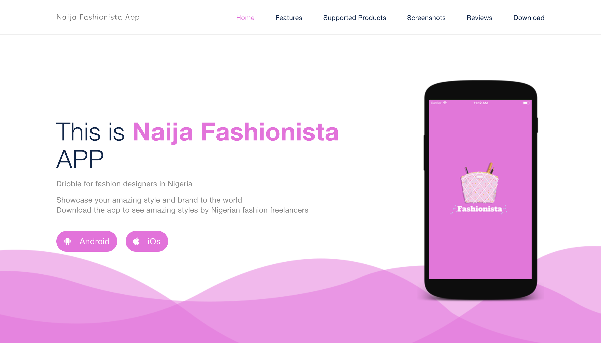

## Naija Fashionista App :fire: 

Naija Fashionista App is the `Dribble` for fashion designers.
This app allows fashion designers to showcase thier products and get leads online.
This is an ideal social media network for fashion geeks.

This project was built during the #NAIJAHACKS2018 Hackathon contest

### Website
Visit http://team-fire.tech/  

### Setup the app on your machine:  
1. git clone this repo  
2. run `npm install` to install all dependencies needed.  
3. make .env file, supply every api key and endpoints specified in .env.sample.  
3. run `npm start` to get the server up and running.  

### Technologies Used:  
- NodeJS for the API
- React-Native
- Cloudinary
- MongoDB

### Contributors
* [Seun Daramola](https://github.com/seunzone) --- Software Developer @Andela
* [IB Olamilekan](https://github.com/leksyib) --- Freelance DevOps Engineer & Backend developer

